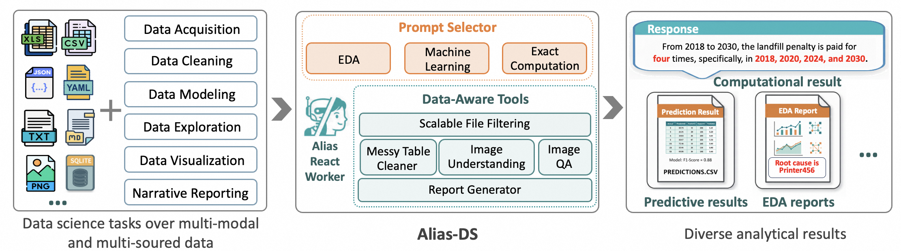

<h2 align="center">Alias for Data Science</h2>
An autonomous agent that runs your entire data science workflow.

## Overview

  

**Alias-DataScience** is an **autonomous**, **ready-to-use**, intelligent assistant for real-world **data science workflows**. It transforms high-level analytical questions into executable plans, which can seamlessly handle data acquisition, cleaning, modeling, visualization, and narrative reporting, with minimal human intervention.

## ✨ Key Features

### 🔍 Scalable File Filtering
To handle massive data files commonly found in enterprise data lakes, Alias-DataScience combines parallelized grep operations with Retrieval-Augmented Generation (RAG) to build a low-latency, high-throughput file filtering pipeline. This preprocessing step enables accurate identification of relevant files, significantly expanding our scope and applicability.

### 🧠 Context-Aware Prompt Engineering
Rather than relying on generic instructions, Alias-DataScience employs three specialized prompt templates, each fine-tuned for a dominant data science workflow:

- **Exploratory Data Analysis (EDA)**: Surfaces trends, anomalies, and relationships to answer "what's happening?" and "why?"
- **Predictive Modeling**: Automates feature engineering, model selection, and optimization.
- **Exact Data Computation**: Delivers precise, auditable answers to quantitative queries (e.g., "What was the YoY revenue growth in Q3?").

An intelligent **prompt selector** routes tasks to the best template based on user intent.

### 📊 Handling of Messy Tabular Data
Alias-DataScience parses irregular spreadsheets (merged cells, embedded notes, multi-level headers) and converts them into structured tables. For large files, it outputs a semantic-preserving JSON representation, enabling reliable analysis of human-crafted inputs.

### 👁️ Multimodal Understanding of Visual Content
- **Image Understanding**: Interprets charts, diagrams, and general images to extract numerical data, trends, and domain-specific entities
- **Visual QA**: Answers natural-language questions about visual elements (e.g., "What was the peak value in Q3?").

### 📑 Automated Reporting
For EDA tasks, Alias-DataScience generates an interactive HTML report featuring:
- Actionable insights backed by statistics and visuals,
- Executable code snippets for transparency and reuse.

This bridges the gap between data scientists and stakeholders like business users or auditors.

## 📈 Benchmark Performance

Alias-DataScience achieves **state-of-the-art (SOTA)** across major data science agent benchmarks.

### [DSBench](https://github.com/LiqiangJing/DSBench)
*Realistic tasks from ModelOff & Kaggle; includes multimodal inputs, multi-source data, and large-scale modeling.*

<table style="border-collapse: collapse; width: 100%; font-family: -apple-system, BlinkMacSystemFont, 'Segoe UI', Roboto, sans-serif; font-size: 14px; margin: 16px 0;">
  <thead>
    <tr style="background-color: #4CAF50; color: white;">
      <th style="border: 1px solid #ddd; padding: 8px 10px; text-align: left;">Task Category</th>
      <th style="border: 1px solid #ddd; padding: 8px 10px; text-align: left;">Framework</th>
      <th style="border: 1px solid #ddd; padding: 8px 10px; text-align: left;">Model</th>
      <th style="border: 1px solid #ddd; padding: 8px 10px; text-align: center;">Score</th>
    </tr>
  </thead>
  <tbody>
    <tr style="background-color: #f9f9f9;">
      <td rowspan="5" style="border: 1px solid #ddd; padding: 8px 10px; vertical-align: top; font-weight: bold;">Data Analysis</td>
      <td style="border: 1px solid #ddd; padding: 8px 10px;"><strong>Alias-DataScience</strong></td>
      <td style="border: 1px solid #ddd; padding: 8px 10px;">Qwen3-max-Preview</td>
      <td style="border: 1px solid #ddd; padding: 8px 10px; text-align: center; background-color: #fff3cd; font-weight: bold;">55.58% 🏆</td>
    </tr>
    <tr style="background-color: #f9f9f9;">
      <td style="border: 1px solid #ddd; padding: 8px 10px;"><a href="https://github.com/microsoft/autogen" target="_blank" rel="noopener">AutoGen</a></td>
      <td style="border: 1px solid #ddd; padding: 8px 10px;">GPT-4</td>
      <td style="border: 1px solid #ddd; padding: 8px 10px; text-align: center;">30.69%</td>
    </tr>
    <tr style="background-color: #f9f9f9;">
      <td style="border: 1px solid #ddd; padding: 8px 10px;">AutoGen</td>
      <td style="border: 1px solid #ddd; padding: 8px 10px;">GPT-4o</td>
      <td style="border: 1px solid #ddd; padding: 8px 10px; text-align: center;">34.12%</td>
    </tr>
    <tr style="background-color: #f9f9f9;">
      <td style="border: 1px solid #ddd; padding: 8px 10px;"><a href="https://platform.openai.com/docs/assistants/tools/code-interpreter" target="_blank" rel="noopener">CodeInterpreter</a></td>
      <td style="border: 1px solid #ddd; padding: 8px 10px;">GPT-4</td>
      <td style="border: 1px solid #ddd; padding: 8px 10px; text-align: center;">26.39%</td>
    </tr>
    <tr style="background-color: #f9f9f9;">
      <td style="border: 1px solid #ddd; padding: 8px 10px;">CodeInterpreter</td>
      <td style="border: 1px solid #ddd; padding: 8px 10px;">GPT-4o</td>
      <td style="border: 1px solid #ddd; padding: 8px 10px; text-align: center;">23.82%</td>
    </tr>
    <tr style="background-color: #ffffff;">
      <td rowspan="5" style="border: 1px solid #ddd; padding: 8px 10px; vertical-align: top; font-weight: bold;">Data Modeling</td>
      <td style="border: 1px solid #ddd; padding: 8px 10px;"><strong>Alias-DataScience</strong></td>
      <td style="border: 1px solid #ddd; padding: 8px 10px;">Qwen3-max-Preview</td>
      <td style="border: 1px solid #ddd; padding: 8px 10px; text-align: center; background-color: #fff3cd; font-weight: bold;">49.70% 🏆</td>
    </tr>
    <tr style="background-color: #ffffff;">
      <td style="border: 1px solid #ddd; padding: 8px 10px;"><a href="https://github.com/microsoft/autogen" target="_blank" rel="noopener">AutoGen</a></td>
      <td style="border: 1px solid #ddd; padding: 8px 10px;">GPT-4</td>
      <td style="border: 1px solid #ddd; padding: 8px 10px; text-align: center;">45.52%</td>
    </tr>
    <tr style="background-color: #ffffff;">
      <td style="border: 1px solid #ddd; padding: 8px 10px;">AutoGen</td>
      <td style="border: 1px solid #ddd; padding: 8px 10px;">GPT-4o</td>
      <td style="border: 1px solid #ddd; padding: 8px 10px; text-align: center;">34.74%</td>
    </tr>
    <tr style="background-color: #ffffff;">
      <td style="border: 1px solid #ddd; padding: 8px 10px;"><a href="https://platform.openai.com/docs/assistants/tools/code-interpreter" target="_blank" rel="noopener">CodeInterpreter</a></td>
      <td style="border: 1px solid #ddd; padding: 8px 10px;">GPT-4</td>
      <td style="border: 1px solid #ddd; padding: 8px 10px; text-align: center;">26.14%</td>
    </tr>
    <tr style="background-color: #ffffff;">
      <td style="border: 1px solid #ddd; padding: 8px 10px;">CodeInterpreter</td>
      <td style="border: 1px solid #ddd; padding: 8px 10px;">GPT-4o</td>
      <td style="border: 1px solid #ddd; padding: 8px 10px; text-align: center;">16.90%</td>
    </tr>
  </tbody>
</table>

---

### [InsightBench](https://insightbench.github.io/)
*Open-ended comprehensive analytical tasks.*

<table style="border-collapse: collapse; width: 100%; font-family: -apple-system, BlinkMacSystemFont, 'Segoe UI', Roboto, sans-serif; font-size: 14px; margin: 16px 0;">
  <thead>
    <tr style="background-color: #4CAF50; color: white;">
      <th style="border: 1px solid #ddd; padding: 8px 10px; text-align: left;">Framework</th>
      <th style="border: 1px solid #ddd; padding: 8px 10px; text-align: left;">Model</th>
      <th style="border: 1px solid #ddd; padding: 8px 10px; text-align: center;">Score</th>
    </tr>
  </thead>
  <tbody>
    <tr style="background-color: #f9f9f9;">
      <td style="border: 1px solid #ddd; padding: 8px 10px; font-weight: bold;">Alias-DataScience</td>
      <td style="border: 1px solid #ddd; padding: 8px 10px;">Qwen3-max-Preview</td>
      <td style="border: 1px solid #ddd; padding: 8px 10px; text-align: center; background-color: #fff3cd; font-weight: bold;">43.29% 🏆</td>
    </tr>
    <tr style="background-color: #ffffff;">
      <td style="border: 1px solid #ddd; padding: 8px 10px;"><a href="https://insightbench.github.io/" target="_blank" rel="noopener">AgentPoirot</a></td>
      <td style="border: 1px solid #ddd; padding: 8px 10px;">Qwen3-max-Preview</td>
      <td style="border: 1px solid #ddd; padding: 8px 10px; text-align: center;">39.30%</td>
    </tr>
  </tbody>
</table>

---

### [DABench](https://github.com/InfiAgent/InfiAgent)
*End-to-end data analysis from real-world CSVs.*

<table style="border-collapse: collapse; width: 100%; font-family: -apple-system, BlinkMacSystemFont, 'Segoe UI', Roboto, sans-serif; font-size: 14px; margin: 16px 0;">
  <thead>
    <tr style="background-color: #4CAF50; color: white;">
      <th style="border: 1px solid #ddd; padding: 8px 10px; text-align: left;">Framework</th>
      <th style="border: 1px solid #ddd; padding: 8px 10px; text-align: left;">Model</th>
      <th style="border: 1px solid #ddd; padding: 8px 10px; text-align: center;">Score</th>
    </tr>
  </thead>
  <tbody>
    <tr style="background-color: #f9f9f9;">
      <td style="border: 1px solid #ddd; padding: 8px 10px; font-weight: bold;">Alias-DataScience</td>
      <td style="border: 1px solid #ddd; padding: 8px 10px;">Qwen3-max-Preview</td>
      <td style="border: 1px solid #ddd; padding: 8px 10px; text-align: center; background-color: #fff3cd; font-weight: bold;">95.20% 🏆</td>
    </tr>
    <tr style="background-color: #ffffff;">
      <td style="border: 1px solid #ddd; padding: 8px 10px;"><a href="https://github.com/microsoft/autogen" target="_blank" rel="noopener">AutoGen</a></td>
      <td style="border: 1px solid #ddd; padding: 8px 10px;">GPT-4</td>
      <td style="border: 1px solid #ddd; padding: 8px 10px; text-align: center;">71.49%</td>
    </tr>
    <tr style="background-color: #f9f9f9;">
      <td style="border: 1px solid #ddd; padding: 8px 10px;">
      <a href="https://github.com/FoundationAgents/MetaGPT" target="_blank" rel="noopener">Data Interpreter</a></td>
      <td style="border: 1px solid #ddd; padding: 8px 10px;">GPT-4</td>
      <td style="border: 1px solid #ddd; padding: 8px 10px; text-align: center;">73.55%</td>
    </tr>
    <tr style="background-color: #ffffff;">
      <td style="border: 1px solid #ddd; padding: 8px 10px;">Data Interpreter</td>
      <td style="border: 1px solid #ddd; padding: 8px 10px;">GPT-4o</td>
      <td style="border: 1px solid #ddd; padding: 8px 10px; text-align: center;">94.93%</td>
    </tr>
  </tbody>
</table>

  Some tables include data from published sources, used with gratitude to the original authors and cited in good faith. For accuracy, please refer to the original publications.

## 🎯 Use Cases

### 1. Machine Learning

  

### 2. Exact Data Computation

  

### 3. Exploratory Data Analysis

  

