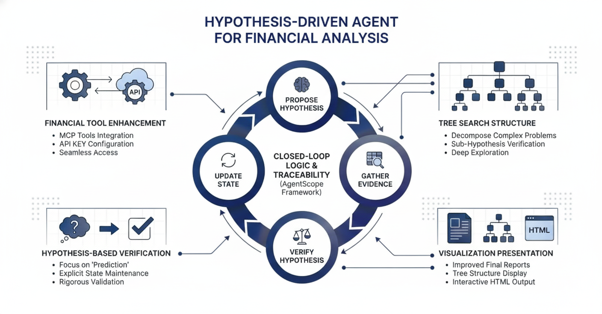
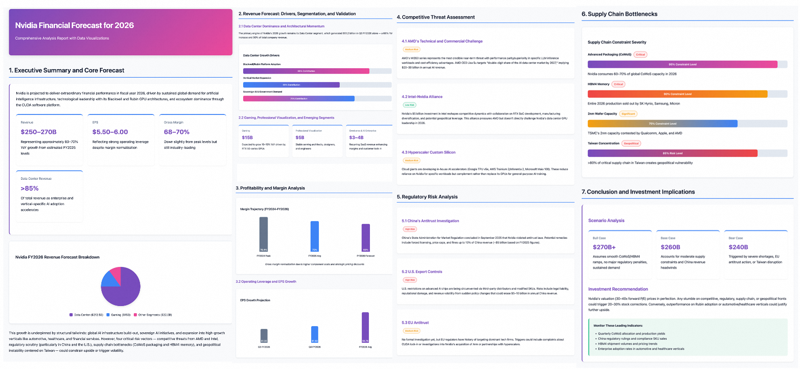
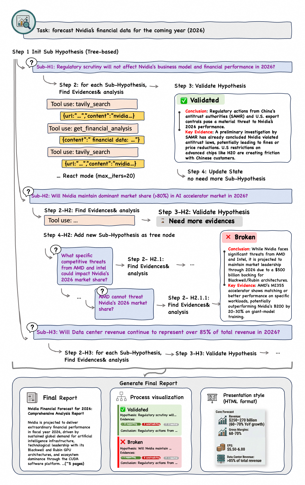

<h2 align="center">Alias for Finance Analysis</h2>
An autonomous, hypothesis-driven deep research agent for complex financial and investment analysis.

## Overview
<div align="center">
  
</div>

**Alias-Finance Analysis** is a specialized enhancement/adaptation of the Alias, purpose-built to address the unique challenges of financial analysis: the need for complex reasoning and rigorous evidence chains.

Unlike traditional autonomous agents that simply decompose tasks into steps, Alias-Finance Analysis adopts a **Hypothesis-Driven** architecture. It transforms open-ended financial inquiries into a rigorous scientific loop: **"Propose Hypothesis → Evidence Analysis->Verify Hypothesis → Update State."** Built on the **AgentScope** framework, Alias-Finance Analysis ensures that every analytical conclusion is backed by a transparent, traceable logical path, bridging the gap between AI autonomy and the strict explainability requirements of the financial sector.


## Key Features
### Hypothesis-Driven Reasoning
In high-stakes financial scenarios, simple task execution is insufficient. Alias-Finance Analysis introduces a state-aware reasoning mechanism designed for prediction and verification.

+ **Dynamic State Maintenance:** Instead of a linear to-do list, the agent maintains a "Hypothesis Task."
+ **The Loop:** It actively proposes a market assumption, gathers specific data to test it, verifies the validity, and updates its belief state accordingly.

### Tree-Structured Deep Search
Financial problems are rarely one-dimensional. To handle complexity, Alias-Finance Analysis utilizes a **Tree Search** strategy similar to deep research algorithms but adapted for financial logic.

+ **Decomposition:** A complex query (e.g., "Is Company X a buy?") is broken down into a tree of sub-hypotheses (e.g., "Revenue Growth," "Market Risk," "Competitive Moat").
+ **Tree Exploration:** The agent systematically explores these branches to ensure no critical factor is overlooked before aggregating the results into a final conclusion.


### Enhanced Financial Tool Integration
Alias-Finance Analysis is ready to deploy with professional-grade data capabilities.

+ **MCP Integration:** We use Tavily Search as the general tool. What's more, we have integrated existing Financial **Model Context Protocol (MCP)** tools (available via Bailian/Alibaba Cloud).

Users simply need to configure their API KEY to unlock access to real-time financial data. Follow this [guide](https://bailian.console.aliyun.com/?tab=doc#/doc/?type=app&url=2974821) to activate the MCP service.

| **Tool Name**                                                                                                                            | **Description**                                                                     |
|------------------------------------------------------------------------------------------------------------------------------------------|-------------------------------------------------------------------------------------|
| **Stock/Market Data API**<br/>**（**[tdx-mcp](https://bailian.console.aliyun.com/tab=app#/mcp-market/detail/tendency-software)**)**       | Provides real-time quotes, historical prices, technical indicators and fundamentals. |
| **Investment Research & Advisory API**<br/>**(**[Qieman-mcp](https://bailian.console.aliyun.com/?tab=mcp#/mcp-market/detail/Qieman)**)** | Provides research content, investment analysis and advisory tools                  |


### Visualization & Reporting
Transform complex financial analysis into clear, traceable, and presentation-ready outputs.



| **Output Element** | **Description** | **Purpose** |
| --- | --- | --- |
| **Final Research Report** | **Narrative Text & Insights** | The complete written analysis, conclusions, statistical evidence, and recommendations. |
| **Process Visualization** | **Traceable Tree Search Map** | An interactive graphical view showing the full execution path: **which hypotheses were tested, which evidence was collected, and the specific decision points (Verified/Abandoned).** |
| **Presentation-Friendly HTML Report** | **Executive Summary & Visuals** | A condensed, visually rich format optimized for review, featuring key charts and summary bullets. |


## Workflow

<p align="center">
  
</p>

**This diagram illustrates the hypothesis-driven workflow used to forecast Nvidia's 2026 financial performance, including evidence gathering, validation steps, and final report generation.**

+ Converts open-ended financial questions into testable hypotheses.
+ Runs a continuous loop of “propose → gather evidence → verify → update.”
+ Maintains a dynamic state rather than a static task list.
+ Ensures every conclusion is backed by transparent, traceable reasoning steps.
+ Produces a final forecast grounded in validated assumptions.

## 📊 Benchmark Performance
This section presents a comprehensive evaluation of Alias-Finance Analysis across two specialized benchmarks: FinDeepResearch and LiveDeepResearch (Internal Benchmark).

### [FinDeepResearch](https://www.arxiv.org/pdf/2510.13936)
**FinDeepResearch is a performance evaluation benchmark designed for Large Language Model-driven Deep Research (DR) Agents.** Utilizing the **HisRubric** framework, it systematically assesses the agents' capability to complete critical analysis steps in **corporate financial analysis**, ranging from data recognition and metric calculation to strategic summarization and interpretation. The benchmark includes data from 64 listed companies across 8 financial markets and 4 languages.

| **Method** | **US** | **UK** | **CN** | **HK** | **AU** | **SG** | **MY** | **ID** |
| --- | --- | --- | --- | --- | --- | --- | --- | --- |
| **LLM (Thinking)** | | | | | | | | |
| Gemini 2.5 Pro (T) | 19.9 | 21.0 | 17.6 | 20.8 | 24.4 | 24.2 | 25.1 | 16.5 |
| Deepseek-v3.2 (T) | 19.7 | 17.7 | 17.3 | 18.4 | 20.9 | 21.0 | 23.8 | 15.0 |
| Claude-Sonnet-4.5 (T) | 22.2 | 19.9 | 19.1 | 21.7 | 23.0 | 22.7 | 24.7 | 17.0 |
| Grok 4 (T) | 23.2 | **24.0** | 16.9 | 18.4 | **25.8** | 24.3 | 25.0 | 17.4 |
| OpenAI GPT-5 (T) | 18.1 | 18.7 | 16.6 | 17.6 | 22.6 | 23.6 | 23.3 | 16.3 |
| **LLM (Thinking + Search)** | | | | | | | | |
| Gemini 2.5 Pro (T+S) | 22.9 | 20.7 | 20.4 | $\underline{\text{24.7}}$ | 26.4 | 27.6 | 27.5 | 20.9 |
| Deepseek-v3.2 (T+S) | 10.9 | 14.9 | 16.8 | 16.5 | 20.4 | 17.7 | 21.0 | 10.0 |
| Claude-Sonnet-4.5 (T+S) | 27.8 | 23.0 | $\underline{\text{25.7}}$ | 20.3 | 27.4 | 28.5 | $\underline{\text{30.4}}$ | 23.4 |
| Grok 4 (T+S) | 23.7 | 22.4 | 17.8 | 19.4 | 27.2 | 24.6 | 25.0 | 16.4 |
| OpenAI GPT-5 (T+S) | 37.4 | 36.9 | 20.8 | 29.3 | 35.6 | $\underline{\text{42.5}}$ | 32.3 | 29.1 |
| **Deep Research** | | | | | | | | |
| Perplexity Sonar Deep Research | 21.0 | 23.7 | 22.4 | 25.0 | 28.8 | 26.9 | 26.9 | 23.0 |
| Mistral Deep Research | 13.5 | 16.1 | 14.0 | 13.6 | 22.2 | 21.1 | 23.7 | 17.1 |
| Tongyi Deep Research | 32.1 | 27.8 | 27.8 | 29.5 | 36.1 | 35.6 | 37.3 | 30.3 |
| Gemini 2.5 Pro Deep Research | $\underline{\text{37.6}}$ | 34.1 | 30.8 | **36.0** | 36.0 | 38.9 | 39.8 | **36.6** |
| Grok 4 DeepSearch | 34.5 | **39.0** | **33.4** | $\underline{\text{36.4}}$ | $\underline{\text{39.3}}$ | **46.7** | 37.9 | 31.3 |
| OpenAI o3-deep-research | **42.5** | $\underline{\text{43.0}}$ | **34.7** | 30.2 | **41.7** | 33.6 | **38.3** | $\underline{\text{38.9}}$ |
| **Alias-Finance Analysis** | TBD | TBD | TBD | TBD | TBD | TBD | TBD | TBD |

### LiveDeepResearch（Internal benchmark)
The LiveDeepResearch Benchmark features a four-dimensional analysis—covering macro, industry, event, and stock-specific analysis—and dynamically constructs queries and rubrics based on real-time market information, ensuring the evaluation is highly practical.

| **Method** | Industry Analysis | Event Analysis | Individual Stock Analysis | Macroeconomic Analysis | Overall |
| --- | --- | --- | --- | --- |---------|
| **LLM(Thinking)** |  |  |  |  |         |
| TBD | TBD | TBD | TBD | TBD | TBD         |
| **Deep Research** |  |  |  |  |         |
| OpenAI DeepResearch | 0.558 | 0.354 | 0.389 | 0.406 | 0.427   |
| Kimi DeepResearch | 0.270 | 0.273 | 0.339 | 0.319 | 0.300   |
| Doubao DeepResearch | 0.519 | 0.611 | 0.647 | 0.611 | 0.597   |
| **Alias-Finance Analysis** | TBD | TBD | TBD | TBD | TBD         |

---

### Getting Started
To get started with Alias-Finance Analysis, you can access the financial analysis features via automatic system routing in the default General mode.

If you wish to explicitly specify this mode, simply run the following command:
```bash
alias_agent run --mode finance --task "Analyze Tesla's Q4 2024 financial performance"
```


