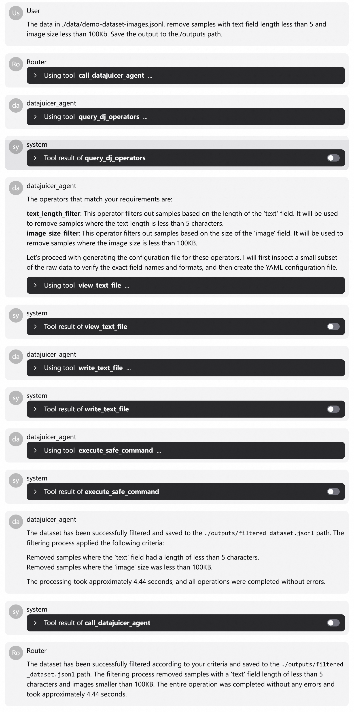

# DataJuicer Agent

A multi-agent data processing system built on [AgentScope](https://github.com/agentscope-ai/agentscope) and [Data-Juicer (DJ)](https://github.com/datajuicer/data-juicer). This project demonstrates how to leverage the natural language understanding capabilities of large language models, enabling non-expert users to easily harness the powerful data processing capabilities of Data-Juicer.

## 🎯 Why DataJuicer Agent?

In the actual work of large model R&D and applications, **data processing remains a high-cost, low-efficiency, and hard-to-reproduce process**. Many teams spend more time on data analysis, cleaning and synthesis than on model training, requirement alignment and app development.

We hope to liberate developers from tedious script assembly through agent technology, making data R&D closer to a "think and get" experience.

**Data directly defines the upper limit of model capabilities**. What truly determines model performance are multiple dimensions such as **quality, diversity, harmfulness control, and task matching** of data. Optimizing data is essentially optimizing the model itself. To do this efficiently, we need a systematic toolset.

DataJuicer Agent is designed to support the new paradigm of **data-model co-optimization** as an intelligent collaboration system.

## 📋 Table of Contents

- [🎯 Why DataJuicer Agent?](#-why-datajuicer-agent)
- [📋 Table of Contents](#-table-of-contents)
- [What Does This Agent Do?](#what-does-this-agent-do)
- [Architecture](#architecture)
  - [Multi-Agent Routing Architecture](#multi-agent-routing-architecture)
  - [Two Integration Modes](#two-integration-modes)
- [Quick Start](#quick-start)
  - [System Requirements](#system-requirements)
  - [Installation](#installation)
  - [Configuration](#configuration)
  - [Usage](#usage)
- [Agent Introduction](#agent-introduction)
  - [Data Processing Agent](#data-processing-agent)
  - [Code Development Agent (DJ Dev Agent)](#code-development-agent-dj-dev-agent)
- [Advanced Features](#advanced-features)
  - [Operator Retrieval](#operator-retrieval)
    - [Retrieval Modes](#retrieval-modes)
    - [Usage](#usage-1)
  - [MCP Agent](#mcp-agent)
    - [MCP Server Types](#mcp-server-types)
    - [Configuration](#configuration-1)
    - [Usage Methods](#usage-methods)
- [Customization and Extension](#customization-and-extension)
  - [Custom Prompts](#custom-prompts)
  - [Model Replacement](#model-replacement)
  - [Extending New Agents](#extending-new-agents)
- [Roadmap](#roadmap)
  - [Data-Juicer Q\&A Agent (Demo Available)](#data-juicer-qa-agent-demo-available)
  - [Interactive Data Analysis and Visualization Agent (In Development)](#interactive-data-analysis-and-visualization-agent-in-development)
  - [Other Directions](#other-directions)
  - [Common Issues](#common-issues)
  - [Optimization Recommendations](#optimization-recommendations)
- [Related Resources](#related-resources)

## What Does This Agent Do?

Data-Juicer (DJ) is an **open-source processing system covering the full lifecycle of large model data**, providing four core capabilities:

- **Full-Stack Operator Library (DJ-OP)**: Nearly 200 high-performance, reusable multimodal operators covering text, images, and audio/video
- **High-Performance Engine (DJ-Core)**: Built on Ray, supporting TB-level data, 10K-core distributed computing, with operator fusion and multi-granularity fault tolerance
- **Collaborative Development Platform (DJ-Sandbox)**: Introduces A/B Test and Scaling Law concepts, using small-scale experiments to drive large-scale optimization
- **Natural Language Interaction Layer (DJ-Agents)**: Enables developers to build data pipelines through conversational interfaces using Agent technology

DataJuicer Agent is not a simple Q&A bot, but an **intelligent collaborator for data processing**. Specifically, it can:

- **Intelligent Query**: Automatically match the most suitable operators based on natural language descriptions (precisely locating from nearly 200 operators)
- **Automated Pipeline**: Describe data processing needs, automatically generate Data-Juicer YAML configurations and execute them
- **Custom Extension**: Help users develop custom operators and seamlessly integrate them into local environments

**Our goal: Let developers focus on "what to do" rather than "how to do it"**.

## Architecture

### Multi-Agent Routing Architecture

DataJuicer Agent adopts a **multi-agent routing architecture**, which is key to system scalability. When a user inputs a natural language request, the **Router Agent** first performs task triage to determine whether it's a standard data processing task or a custom requirement that needs new capabilities.

```
User Query
    ↓
Router Agent (Task Triage)
    ├── Standard Data Processing Task → Data Processing Agent (DJ Agent)
    │   ├── Preview data samples (confirm field names and data format)
    │   ├── query_dj_operators (semantic matching of operators)
    │   ├── Generate YAML configuration file
    │   └── execute_safe_command (execute dj-process, dj-analyze)
    │
    └── Custom Operator Development → Code Development Agent (DJ Dev Agent)
        ├── get_basic_files (get base classes and registration mechanism)
        ├── get_operator_example (get similar operator examples)
        ├── Generate code compliant with specifications
        └── Local integration (register to user-specified path)
```

### Two Integration Modes

Agent integration with DataJuicer has two modes to adapt to different usage scenarios:

- **Tool Binding Mode**: Agent calls DataJuicer command-line tools (such as `dj-analyze`, `dj-process`), compatible with existing user habits, low migration cost
- **MCP Binding Mode**: Agent directly calls DataJuicer's MCP (Model Context Protocol) interface, no need to generate intermediate YAML files, directly run operators or data recipes, better performance

These two modes are automatically selected by the Agent based on task complexity and performance requirements, ensuring both flexibility and efficiency.

## Quick Start

### System Requirements

- Python 3.10+
- Valid DashScope API key
- Optional: Data-Juicer source code (for custom operator development)

### Installation

```bash
# Recommended to use uv
uv pip install -r requirements.txt
```

or

```bash
pip install -r requirements.txt
```

### Configuration

1. **Set API Key**

```bash
export DASHSCOPE_API_KEY="your-dashscope-key"
```

2. **Optional: Configure Data-Juicer Path (for custom operator development)**

```bash
export DATA_JUICER_PATH="your-data-juicer-path"
```

> **Tip**: You can also set this during runtime through conversation, for example:
> - "Help me set the DataJuicer path: /path/to/data-juicer"
> - "Help me update the DataJuicer path: /path/to/data-juicer"

### Usage

Choose the running mode using the `-u` or `--use_studio` parameter:

```bash
# Use AgentScope Studio's interactive interface (please install and start AgentScope Studio first)
python main.py --use_studio True

# Or use command line mode directly (default)
python main.py
```

Note:

Install AgentScope Studio via npm:

```bash
npm install -g @agentscope/studio
```

Start Studio with the following command:

```bash
as_studio
```

## Agent Introduction

### Data Processing Agent

Responsible for interacting with Data-Juicer and executing actual data processing tasks. Supports automatic operator recommendation from natural language descriptions, configuration generation, and execution.

**Workflow:**

When a user says: "My data is saved in xxx, please clean entries with text length less than 5 and image size less than 10MB", the Agent doesn't blindly execute, but proceeds step by step:

1. **Data Preview**: Preview the first 5–10 data samples to confirm field names and data format—this is a crucial step to avoid configuration errors
2. **Operator Retrieval**: Call the `query_dj_operators` tool to semantically match suitable operators
3. **Parameter Decision**: LLM autonomously decides global parameters (such as dataset_path, export_path) and specific operator configurations
4. **Configuration Generation**: Generate standard YAML configuration files
5. **Execute Processing**: Call the `dj-process` command to execute actual processing

The entire process is both automated and explainable. Users can intervene at any stage to ensure results meet expectations.

**Typical Use Cases:**
- **Data Cleaning**: Deduplication, removal of low-quality samples, format standardization
- **Multimodal Processing**: Process text, image, and video data simultaneously
- **Batch Conversion**: Format conversion, data augmentation, feature extraction

<details>
<summary>View Complete Example Log (from AgentScope Studio)</summary>

</details>

**Example Execution Flow:**

User input: "The data in ./data/demo-dataset-images.jsonl, remove samples with text field length less than 5 and image size less than 100Kb..."

Agent execution steps:
1. Call `query_dj_operators`, accurately returning two operators: `text_length_filter` and `image_size_filter`
2. Use `view_text_file` tool to preview raw data, confirming fields are indeed 'text' and 'image'
3. Generate YAML configuration and save to temporary path via `write_text_file`
4. Call `execute_safe_command` to execute `dj-process`, returning result path

The entire process requires no manual intervention, but every step is traceable and verifiable. **This is exactly the "automated but not out of control" data processing experience we pursue**.

### Code Development Agent (DJ Dev Agent)

When built-in operators cannot meet requirements, the traditional approach is: check documentation, copy code, adjust parameters, write tests—this process can take hours.

The goal of Operator Development Agent is to compress this process to minutes while ensuring code quality. Powered by the `qwen3-coder-480b-a35b-instruct` model by default.

**Workflow:**

When a user requests: "Help me create an operator that reverses word order and generate unit test files", the Router routes it to DJ Dev Agent.

The Agent's execution process consists of four steps:

1. **Operator Retrieval**: Find existing operators with similar functionality as references
2. **Get Templates**: Pull base class files and typical examples to ensure consistent code style
3. **Generate Code**: Based on the function prototype provided by the user, generate operator classes compliant with DataJuicer specifications
4. **Local Integration**: Register the new operator to the user-specified local codebase path

The entire process transforms vague requirements into runnable, testable, and reusable modules.

**Generated Content:**

- **Implement Operator**: Create operator class file, inherit from Mapper/Filter base class, register using `@OPERATORS.register_module` decorator
- **Update Registration**: Modify `__init__.py`, add new class to `__all__` list
- **Write Tests**: Generate unit tests covering multiple scenarios, including edge cases, ensuring robustness

**Typical Use Cases:**
- **Develop domain-specific filter or transformation operators**
- **Integrate proprietary data processing logic**
- **Extend Data-Juicer capabilities for specific scenarios**

<details>
<summary>View Complete Example Log (from AgentScope Studio)</summary>

</details>

## Advanced Features

### Operator Retrieval

Operator retrieval is the core of whether the Agent can work accurately. DJ Agent implements an intelligent operator retrieval tool that quickly finds the most relevant operators from Data-Juicer's nearly 200 operators through an independent LLM query process. This is a key component enabling the data processing agent and code development agent to run accurately.

We don't use a single solution, but provide three modes that can be flexibly selected via the `-r` parameter:

#### Retrieval Modes

**LLM Retrieval (default)**
- Uses Qwen-Turbo to understand user requirements from a semantic level, suitable for complex and vague descriptions
- Provides detailed matching reasons and relevance scores
- Higher token consumption, but highest matching accuracy

**Vector Retrieval (vector)**
- Based on DashScope text embedding + FAISS similarity search
- Fast, suitable for batch tasks or rapid prototyping
- No need to call LLM, lower cost

**Auto Mode (auto)**
- Prioritizes LLM retrieval, automatically falls back to vector retrieval on failure

#### Usage

Specify the retrieval mode using the `-r` or `--retrieve_mode` parameter:

```bash
python main.py --retrieve_mode vector
```

For more parameter descriptions, see `python main.py --help`

### MCP Agent

In addition to command-line tools, DataJuicer also natively supports MCP services, which is an important means to improve performance. MCP services can directly obtain operator information and execute data processing through native interfaces, making it easy to migrate and integrate without separate LLM queries and command-line calls.

#### MCP Server Types

Data-Juicer provides two types of MCP:

**Recipe-Flow MCP (Data Recipe)**
- Provides two tools: `get_data_processing_ops` and `run_data_recipe`
- Retrieves by operator type, applicable modalities, and other tags, **no need to call LLM or vector models**
- Suitable for standardized, high-frequency scenarios with better performance

**Granular-Operators MCP (Fine-grained Operators)**
- Wraps each built-in operator as an independent tool, runs on call
- Returns all operators by default, but can control visible scope through environment variables
- Suitable for fine-grained control, building fully customized data processing pipelines

This means that in some scenarios, the Agent's call path can be *shorter, faster, and more direct* than manually writing YAML.

For detailed information, please refer to: [Data-Juicer MCP Service Documentation](https://datajuicer.github.io/data-juicer/en/main/docs/DJ_service.html#mcp-server)

> **Note**: The Data-Juicer MCP server is currently in early development, and features and tools may change with ongoing development.

#### Configuration

Configure the service address in `configs/mcp_config.json`:

```json
{
    "mcpServers": {
        "DJ_recipe_flow": {
            "url": "http://127.0.0.1:8080/sse"
        }
    }
}
```

#### Usage Methods

Enable MCP Agent to replace DJ Agent:

```bash
# Enable MCP Agent and Dev Agent
python main.py --available_agents [dj_mcp,dj_dev]

# Or use shorthand
python main.py -a [dj_mcp,dj_dev]
```

## Customization and Extension

### Custom Prompts

All Agent system prompts are defined in the `prompts.py` file.

### Model Replacement

You can specify different models for different Agents in `main.py`. For example:
- Main Agent uses `qwen-max` for complex reasoning
- Development Agent uses `qwen3-coder-480b-a35b-instruct` to optimize code generation quality

At the same time, Formatter and Memory can also be replaced. This design allows the system to be both out-of-the-box and adaptable to enterprise-level requirements.

### Extending New Agents

DataJuicer Agent is an open framework. The core is the `agents2toolkit` function—it can automatically wrap any Agent as a tool callable by the Router.

Simply add your Agent instance to the `agents` list, and the Router will dynamically generate corresponding tools at runtime and automatically route based on task semantics.

This means you can quickly build domain-specific data agents based on this framework.

*Extensibility is an important design principle*.

## Roadmap

The Data-Juicer agent ecosystem is rapidly expanding. Here are the new agents currently in development or planned:

### Data-Juicer Q&A Agent (Demo Available)

Provides users with detailed answers about Data-Juicer operators, concepts, and best practices.

<video controls width="100%" height="auto" playsinline>
    <source src="https://github.com/user-attachments/assets/a8392691-81cf-4a25-94da-967dcf92c685" type="video/mp4">
    Your browser does not support the video tag.
</video>

### Interactive Data Analysis and Visualization Agent (In Development)

We are building a more advanced **human-machine collaborative data optimization workflow** that introduces human feedback:
- Users can view statistics, attribution analysis, and visualization results
- Dynamically edit recipes, approve or reject suggestions
- Underpinned by `dj.analyzer` (data analysis), `dj.attributor` (effect attribution), and `dj.sandbox` (experiment management)
- Supports closed-loop optimization based on validation tasks

### Other Directions

- **Data Processing Agent Benchmarking**: Quantify the performance of different Agents in terms of accuracy, efficiency, and robustness
- **Data "Health Check Report" & Data Intelligent Recommendation**: Automatically diagnose data problems and recommend optimization solutions
- **Router Agent Enhancement**: More seamless, e.g., when operators are lacking → Code Development Agent → Data Processing Agent
- **MCP Further Optimization**: Embedded LLM, users can directly use MCP connected to their local environment (e.g., IDE) to get an experience similar to current data processing agents
- **Knowledge Base and RAG-oriented Data Agents**
- **Better Automatic Processing Solution Generation**: Less token usage, more efficient, higher quality processing results
- **Data Workflow Template Reuse and Automatic Tuning**: Based on DataJuicer community data recipes
- ......

### Common Issues

**Q: How to get DashScope API key?**
A: Visit [DashScope official website](https://dashscope.aliyun.com/) to register an account and apply for an API key.

**Q: Why does operator retrieval fail?**
A: Please check network connection and API key configuration, or try switching to vector retrieval mode.

**Q: How to debug custom operators?**
A: Ensure Data-Juicer path is configured correctly and check the example code provided by the code development agent.

**Q: What to do if MCP service connection fails?**
A: Check if the MCP server is running and confirm the URL address in the configuration file is correct.

**Q: Error: requests.exceptions.HTTPError: 400 Client Error: Bad Request for url: http://localhost:3000/trpc/pushMessage**
A: Please check if AgentScope Studio has been successfully started. Try installing AgentScope Studio first with `npm install -g @agentscope/studio`, then start it with `as_studio`.

### Optimization Recommendations

- For large-scale data processing, it is recommended to use DataJuicer's distributed mode
- Set batch size appropriately to balance memory usage and processing speed
- For more advanced data processing features (synthesis, Data-Model Co-Development), please refer to DataJuicer [documentation](https://datajuicer.github.io/data-juicer/en/main/index.html)

---

## Related Resources

- DataJuicer has been used by a large number of Tongyi and Alibaba Cloud internal and external users, and has facilitated many research works. All code is continuously maintained and enhanced.

*Welcome to visit GitHub, Star, Fork, submit Issues, and join the community!*

- **Project Repositories**:
  - [AgentScope](https://github.com/agentscope-ai/agentscope)
  - [DataJuicer](https://github.com/datajuicer/data-juicer)

**Contributing**: Welcome to submit Issues and Pull Requests to improve AgentScope, DataJuicer Agent, and DataJuicer. If you encounter problems during use or have feature suggestions, please feel free to contact us.