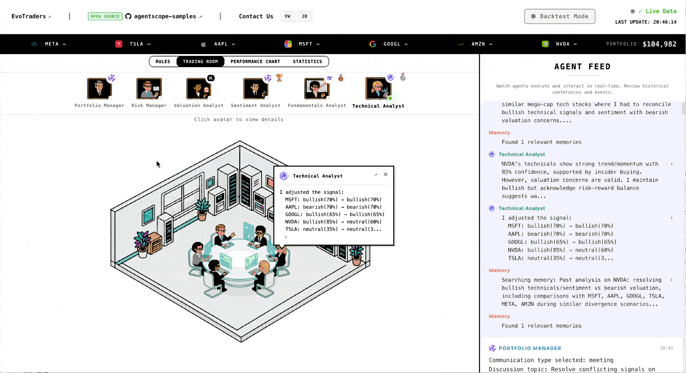
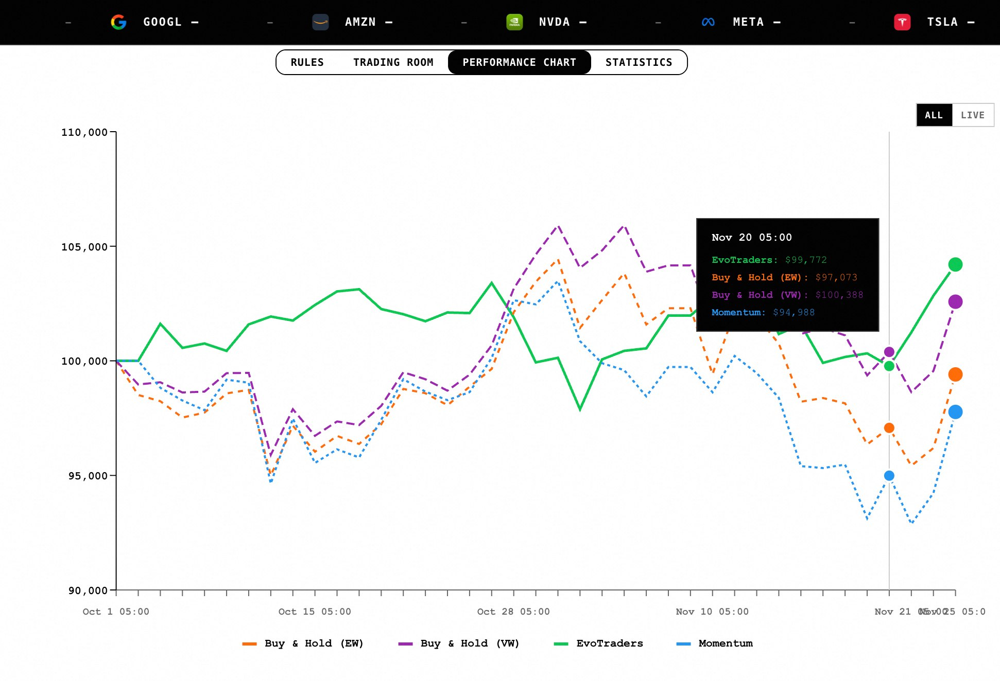
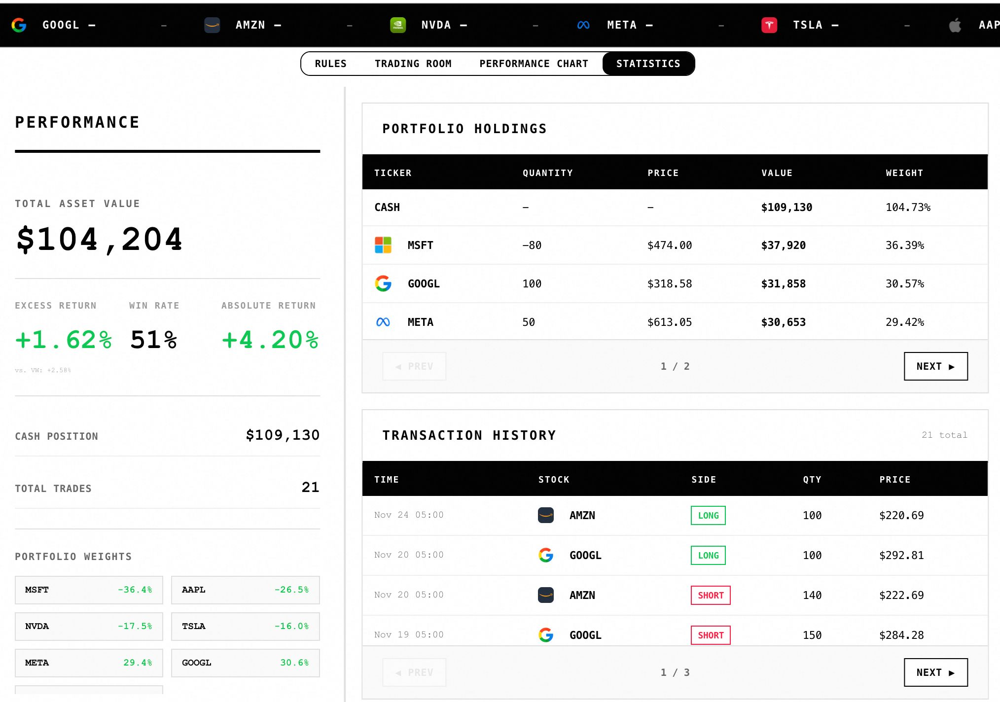
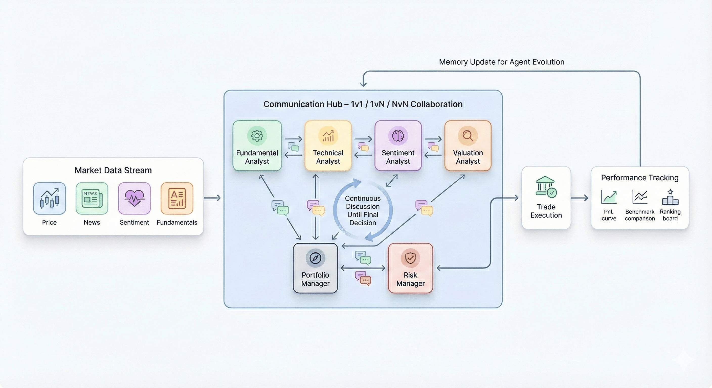

<p align="center">
  
</p>

<h2 align="center">EvoTraders: A Self-Evolving Multi-Agent Trading System</h2>

<p align="center">
  📌 <a href="https://trading.evoagents.cn">Visit us at EvoTraders website !</a>
</p>



EvoTraders is an open-source financial trading agent framework that builds a trading system capable of continuous learning and evolution in real markets through multi-agent collaboration and memory systems.

---

## Core Features

**Multi-Agent Collaborative Trading**
A team of 6 members, including 4 specialized analyst roles (fundamentals, technical, sentiment, valuation) + portfolio manager + risk management, collaborating to make decisions like a real trading team.

You can customize your Agents here: [Custom Configuration](#custom-configuration)

**Continuous Learning and Evolution**
Based on the ReMe memory framework, agents reflect and summarize after each trade, preserving experience across rounds, and forming unique investment methodologies.

Through this design, we hope that when AI Agents form a team and enter the real-time market, they will gradually develop their own trading styles and decision preferences, rather than one-time random inference.

**Real-Time Market Trading**
Supports real-time market data integration, providing backtesting mode and live trading mode, allowing AI Agents to learn and make decisions in real market fluctuations.

**Visualized Trading Information**
Observe agents' analysis processes, communication records, and decision evolution in real-time, with complete tracking of return curves and analyst performance.

<p>
  
  
</p>

---

## Quick Start

### Installation

```bash
# Clone repository
git clone https://github.com/agentscope-ai/agentscope-samples
cd agentscope-samples/EvoTraders

# Install dependencies (Recommend uv!)
uv pip install -e .
# optional: pip install -e .


# Configure environment variables
cp env.template .env
# Edit .env file and add your API Keys. The following config are required:

# finance data API: At minimum, FINANCIAL_DATASETS_API_KEY is required, corresponding to FIN_DATA_SOURCE=financial_datasets; It is recommended to add FINNHUB_API_KEY, corresponding to FIN_DATA_SOURCE=finnhub; If using live mode, FINNHUB_API_KEY must be added
FIN_DATA_SOURCE =   #finnhub or financial_datasets
FINANCIAL_DATASETS_API_KEY=  #Required
FINNHUB_API_KEY=  #Optional

# LLM API for Agents
OPENAI_API_KEY=
OPENAI_BASE_URL=
MODEL_NAME=qwen3-max-preview

# LLM & embedding API for Memory
MEMORY_API_KEY=
```

### Running

**Backtest Mode:**
```bash
evotraders backtest --start 2025-11-01 --end 2025-12-01
evotraders backtest --start 2025-11-01 --end 2025-12-01 --enable-memory # Use Memory
```

If you do not have market data APIs and just want to try the backtest demo, download the offline data and unzip it into `backend/data`:
```bash
wget "https://agentscope-open.oss-cn-beijing.aliyuncs.com/ret_data.zip"
unzip ret_data.zip -d backend/data
```
The zip includes basic stock price data so you can run the backtest demo out of the box.

**Live Trading:**
```bash
evotraders live                    # Run immediately (default)
evotraders live --enable-memory    # Use memory
evotraders live --mock             # Mock mode (testing)
evotraders live -t 22:30           # Run daily at 22:30 local time (auto-converts to NYSE timezone)
```

**Get Help:**
```bash
evotraders --help           # View global CLI help
evotraders backtest --help  # View backtest mode parameters
evotraders live --help      # View live/mock run parameters
```

**Launch Visualization Interface:**
```bash
# Ensure npm is installed, otherwise install it:
# npm install
evotraders frontend                # Default connects to port 8765, you can modify the address in ./frontend/env.local to change the port number
```

Visit `http://localhost:5173/` to view the trading room, select a date and click Run/Replay to observe the decision-making process.

---

## System Architecture



### Agent Design

**Analyst Team:**
- **Fundamentals Analyst**: Financial health, profitability, growth quality
- **Technical Analyst**: Price trends, technical indicators, momentum analysis
- **Sentiment Analyst**: Market sentiment, news sentiment, insider trading
- **Valuation Analyst**: DCF, residual income, EV/EBITDA

**Decision Layer:**
- **Portfolio Manager**: Integrates analysis signals from analysts, executes communication strategies, combines analyst and team historical performance, recent investment memories, and long-term investment experience to make final decisions
- **Risk Management**: Real-time price and volatility monitoring, position limits, multi-layer risk warnings

### Decision Process

```
Real-time Market Data → Independent Analysis → Intelligent Communication (1v1/1vN/NvN) → Decision Execution → Performance Evaluation → Learning and Evolution (Memory Update)
```

Each trading day goes through five stages:

1. **Analysis Stage**: Each agent independently analyzes based on their respective tools and historical experience
2. **Communication Stage**: Exchange views through private chats, notifications, meetings, etc.
3. **Decision Stage**: Portfolio manager makes comprehensive judgments and provides final trades
4. **Evaluation Stage**
   - **Performance Charts**: Track portfolio return curves vs. benchmark strategies (equal-weighted, market-cap weighted, momentum). Used to evaluate overall strategy effectiveness.

   - **Analyst Rankings**: Click on avatars in the Trading Room to view analyst performance (win rate, bull/bear market win rate). Used to understand which analysts provide the most valuable insights.

   - **Statistics**: Detailed position and trading history. Used for in-depth analysis of position management and execution quality.

5. **Review Stage**: Agents reflect on decisions and summarize experiences based on actual returns of the day, and store them in the ReMe memory framework for continuous improvement

---

### Module Support

- **Agent Framework**: [AgentScope](https://github.com/agentscope-ai/agentscope)
- **Memory System**: [ReMe](https://github.com/agentscope-ai/reme)
- **LLM Support**: OpenAI, DeepSeek, Qwen, Moonshot, Zhipu AI, etc.

---

## Custom Configuration

### Custom Analyst Roles

1. Register role information in [./backend/agents/prompts/analyst/personas.yaml](./backend/agents/prompts/analyst/personas.yaml), for example:

```yaml
comprehensive_analyst:
  name: "Comprehensive Analyst"
  focus:
    - ...
  preferred_tools: # Flexibly select based on situation
  description: |
    As a comprehensive analyst ...
```

2. Add role definition in [./backend/config/constants.py](./backend/config/constants.py)
```python
ANALYST_TYPES = {
    # Add new analyst
    "comprehensive_analyst": {
        "display_name": "Comprehensive Analyst",
        "agent_id": "comprehensive_analyst",
        "description": "Uses LLM to intelligently select analysis tools, performs comprehensive analysis",
        "order": 15
    }
}
```

3. Introduce new role in frontend configuration [./frontend/src/config/constants.js](./frontend/src/config/constants.js) (optional)
```javascript
export const AGENTS = [
    // Override one of the agents
  {
    id: "comprehensive_analyst",
    name: "Comprehensive Analyst",
    role: "Comprehensive Analyst",
    avatar: `${ASSET_BASE_URL}/...`,
    colors: { bg: '#F9FDFF', text: '#1565C0', accent: '#1565C0' }
  }
]
```

### Custom Models

Configure models used by different agents in the [.env](.env) file:

```bash
AGENT_SENTIMENT_ANALYST_MODEL_NAME=qwen3-max-preview
AGENT_FUNDAMENTALS_ANALYST_MODEL_NAME=deepseek-chat
AGENT_TECHNICAL_ANALYST_MODEL_NAME=glm-4-plus
AGENT_VALUATION_ANALYST_MODEL_NAME=moonshot-v1-32k
```

### Project Structure

```
EvoTraders/
├── backend/
│   ├── agents/           # Agent implementation
│   ├── communication/    # Communication system
│   ├── memory/          # Memory system (ReMe)
│   ├── tools/           # Analysis toolset
│   ├── servers/         # WebSocket services
│   └── cli.py           # CLI entry point
├── frontend/            # React visualization interface
└── logs_and_memory/     # Logs and memory data
```

---

## License and Disclaimer

EvoTraders is a research and educational project, open-sourced under the Apache 2.0 license.

**Risk Warning**: Before trading with real funds, please conduct thorough testing and risk assessment. Past performance does not guarantee future returns. Investment involves risks, and decisions should be made with caution.
