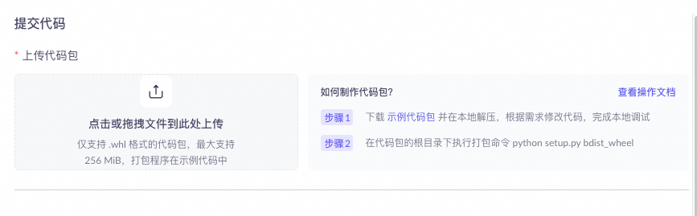
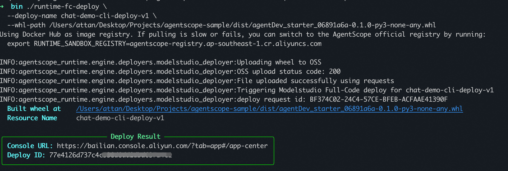

# Alibaba Cloud Bailian High-Code Agent Starter

## Project Introduction

This is a starter project based on FastAPI Web framework and AgentScope, providing you with an initial template code package for deploying Agents locally or via Alibaba Cloud Bailian high-code cloud deployment.
It supports direct local running and testing, and deployment to Alibaba Cloud Bailian via uvicorn, allowing you to freely code and assemble atomic capabilities such as LLM, MCP, RAG, memory, and search from Alibaba Cloud Bailian & AgentScope.

## Installing Dependencies

First, make sure you have Python 3.10 or higher installed.

## Local Startup and Testing

```bash
pip install -r requirements.txt
```

### Dependency Description

- `fastapi`: For building Web APIs
- `uvicorn`: For running FastAPI applications
- `agentscope-runtime`: AgentScope runtime environment
- `PyYAML`: PyYAML parsing package

## Configuration

### DashScope API Configuration

To use LLM features, you need to configure the Alibaba Cloud Bailian DashScope API KEY, which can also be added to the deployment machine's environment variables for subsequent cloud deployment:
1. Set `DASHSCOPE_API_KEY` in the `deploy_starter/config.yml` file:
   ```yaml
   DASHSCOPE_API_KEY: "your-api-key-here,sk-xxx"
   ```

2. Or set it as an environment variable:
   ```bash
   export DASHSCOPE_API_KEY="your-api-key-here,sk-xxx"
   ```

## Running the Project

### Switch to project root directory and run directly

```bash
cd current-project-root-directory, the directory where setup.py is located
```

```bash
python -m deploy_starter.main
```

### Running with uvicorn

```bash
uvicorn deploy_starter.main:app --host 127.0.0.1 --port 8080 --reload
```

## API Endpoints

### Health Check

Check if the application is running properly:

```bash
curl http://127.0.0.1:8080/health
```

Expected response:
```
"OK"
```

### Chat Endpoint

Chat with the LLM (requires DashScope API key configuration):

```bash
curl -X POST http://127.0.0.1:8080/process \
  -H "Content-Type: application/json" \
  -d '{"message": "Hello, world!"}'
```

Expected response:
```json
{
  "response": "Hello! How can I help you?"
}
```

## Notes

1. Chat functionality will be unavailable if `DASHSCOPE_API_KEY` is not configured.
2. The default model is `qwen-turbo`. You can change `DASHSCOPE_MODEL_NAME` in `config.yml` to switch models.

## Alibaba Cloud Bailian High-Code Cloud Deployment

### Preferably, you can directly upload the code package through the Alibaba Cloud Bailian High-Code Console
[Create Application - High-Code Application](https://bailian.console.aliyun.com//app-center?tab=app#/app-center)



### Command-line console method for code upload and deployment - Better for quick code modifications and update deployments
#### 1. Install Dependencies

```bash
pip install agentscope-runtime==1.0.0
pip install "agentscope-runtime[deployment]==1.0.0"
```

#### 2. Set Environment Variables

```bash
export ALIBABA_CLOUD_ACCESS_KEY_ID=...            # Your Alibaba Cloud account AccessKey (required)
export ALIBABA_CLOUD_ACCESS_KEY_SECRET=...        # Your Alibaba Cloud account SecurityKey (required)

# Optional: If you want to use separate OSS AK/SK, you can set the following (if not set, the account AK/SK above will be used). Please ensure the account has OSS read/write permissions.
export MODELSTUDIO_WORKSPACE_ID=...               # Your Bailian workspace ID
export OSS_ACCESS_KEY_ID=...
export OSS_ACCESS_KEY_SECRET=...
export OSS_REGION=cn-beijing
```

#### 3. Packaging and Deployment

##### Method A: Manually build wheel file

Ensure your project can be built into a wheel file. You can use setup.py, setup.cfg, or pyproject.toml.

Build the wheel file:
```bash
python setup.py bdist_wheel
```

Deploy:
```bash
runtime-fc-deploy \
  --deploy-name [your app name] \
  --whl-path [relative path to your wheel file, e.g. "/dist/your_app.whl"]
```



For details, please refer to the Alibaba Cloud Bailian High-Code Deployment Documentation: [Alibaba Cloud Bailian High-Code Deployment Documentation](https://bailian.console.aliyun.com/?tab=api#/api/?type=app&url=2983030)
