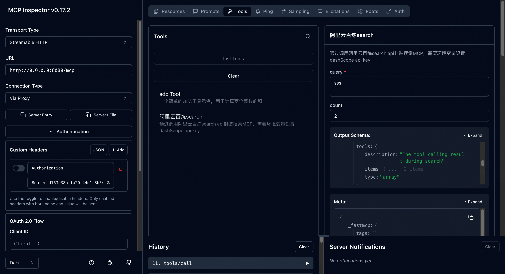

# FastMCP Server 开发模版

> 基于 FastMCP 框架的 MCP Server 开发模版，快速开发并部署到阿里云百炼高代码

## 🎉 特性

本项目核心功能：

- **🔧 模块化架构**: MCP Server 代码分离至 `mcp_server.py`，主程序 `main.py` 负责路由整合
- **💬 Chat API 集成**: 新增 `/process` 端点，支持阿里云百炼 LLM 调用和流式响应
- **🤖 智能工具调用**: LLM 可自动识别并调用 MCP 工具（Function Calling）
- **📡 统一服务架构**: FastAPI + FastMCP 集成，一个服务同时提供 MCP 和 Chat 功能
- **🔄 标准化响应**: 基于 AgentScope ResponseBuilder 的结构化流式响应
- **🌐 CORS 支持**: 支持跨域请求，便于前端集成
- **🎯 路由优化**: MCP Server 挂载至 `/mcp` 路径，主应用提供更多端点

## ⚡ 本地快速开始


### 1. 安装依赖

```bash
pip install -r requirements.txt
```

### 2. 启动服务

```bash
python -m deploy_starter.main
```

### 3. 验证运行

**健康检查:**
```bash
curl http://localhost:8080/health
```

**测试 Chat 接口，调用天气搜索MCP Tool:**
```bash
curl -X POST http://localhost:8080/process \
  -H "Content-Type: application/json" \
  -d '{
    "input": [
      {
        "role": "user",
        "content": [{"type": "text", "text": "帮我查一下杭州的天气，最近5天的"}]
      }
    ],
    "session_id": "test-session-001",
    "stream": true
  }'
```

### 4. 推荐使用MCP Inspector本地先验证MCP server

```bash
npx @modelcontextprotocol/inspector
```
连接地址使用: `http://localhost:8080/mcp`



---

## 🛠️ 开发你的第一个 MCP 工具

在 `deploy_starter/mcp_server.py` 中，使用 `@mcp.tool()` 装饰器定义工具：

> **注意**: 重构后，所有 MCP 工具定义都在 `mcp_server.py` 中，`main.py` 负责集成和路由

### 示例 1: 同步工具（简单调用，IO性能一般）

```python
from typing import Annotated
from pydantic import Field

@mcp.tool(
    name="add Tool",
    description="一个简单的加法工具示例"
)
def add_numbers(
    a: Annotated[int, Field(description="add a")],
    b: Annotated[int, Field(description="add b")]
) -> int:
    return a + b
```

### 示例 2: 异步工具（异步调用，IO性能高）

```python
@mcp.tool(
    name="阿里云百炼search",
    description="通过阿里云百炼 API 搜索"
)
async def search_by_modelStudio(
    query: Annotated[str, Field(description="搜索的query语句")],
    count: Annotated[int, Field(description="搜索返回结果数")] = 5
) -> SearchLiteOutput:
    input_data = SearchLiteInput(query=query, count=count)
    search_component = ModelstudioSearchLite()
    result = await search_component.arun(input_data)
    return result
```

**注意**: 异步工具需要设置环境变量 `DASHSCOPE_API_KEY`用来调用百炼服务
```bash
export DASHSCOPE_API_KEY='sk-xxxxxx'
```


---

## 📝 参数描述规范

使用 `Annotated` + `Field` 为每个参数添加描述：

```python
from typing import Annotated, Optional
from pydantic import Field

@mcp.tool(
    name="your_tool_name",           # 工具名称（AI 看到的名字）
    description="工具的详细描述"      # 工具用途说明
)
def your_tool(
    param1: Annotated[str, Field(description="参数1的描述")],
    param2: Annotated[int, Field(description="参数2的描述")] = 10
) -> dict:
    # 你的业务逻辑
    return {"result": "success"}
```

---
## 阿里云百炼高代码 云端部署

### 优先可以选择阿里云百炼高代码控制台直接上传代码包
[创建应用-高代码应用](https://bailian.console.aliyun.com//app-center?tab=app#/app-center)


### 命令行console方式进行代码上传部署-更适合快速修改代码进行更新部署
#### 1. 安装依赖

```bash
pip install agentscope-runtime==1.0.0
pip install "agentscope-runtime[deployment]==1.0.0"
```

#### 2. 设置环境变量

```bash
export ALIBABA_CLOUD_ACCESS_KEY_ID=...            # 你的阿里云账号AccessKey（必填）
export ALIBABA_CLOUD_ACCESS_KEY_SECRET=...        # 你的阿里云账号SecurityKey（必填）

# 可选：如果你希望使用单独的 OSS AK/SK，可设置如下（未设置时将使用到上面的账号 AK/SK），请确保账号有 OSS 的读写权限
export MODELSTUDIO_WORKSPACE_ID=...               # 你的百炼业务空间id
export OSS_ACCESS_KEY_ID=...
export OSS_ACCESS_KEY_SECRET=...
export OSS_REGION=cn-beijing
```

#### 3. 打包和部署

##### 方式 A：手动构建 wheel 文件

确保你的项目可以被构建为 wheel 文件。你可以使用 setup.py、setup.cfg 或 pyproject.toml。

构建 wheel 文件：
```bash
python setup.py bdist_wheel
```

部署：
```bash
runtime-fc-deploy \
  --deploy-name [你的应用名称] \
  --whl-path [到你的wheel文件的相对路径 如"/dist/your_app.whl"]
```


具体请查看阿里云百炼高代码部署文档：[阿里云百炼高代码部署文档](https://bailian.console.aliyun.com/?tab=api#/api/?type=app&url=2983030)

---

## 📋 项目结构

```
.
├── deploy_starter/
│   ├── main.py          # 主程序 - FastAPI 应用入口，集成 Chat 和 MCP 路由
│   ├── mcp_server.py    # MCP Server 定义 - 在这里定义你的 MCP 工具
│   └── config.yml       # 配置文件
├── requirements.txt     # 依赖列表
├── setup.py            # 打包配置（用于云端部署）
├── README_zh.md        # 中文文档
└── README_en.md        # 英文文档
```

**核心文件说明:**
- `main.py`: FastAPI 主应用，提供 `/process` 端点和生命周期管理，将 MCP Server 挂载到 `/mcp` 路径
- `mcp_server.py`: FastMCP 服务器实例，定义所有 MCP 工具，提供工具列表和调用函数

---

## 🔧 配置说明

编辑 `deploy_starter/config.yml`:

```yaml
# MCP Server 配置
MCP_SERVER_NAME: "my-mcp-server"
MCP_SERVER_VERSION: "1.0.0"

# 服务器配置
FC_START_HOST: "0.0.0.0"  # 云端部署使用
PORT: 8080
HOST: "127.0.0.1"  # 本地开发使用

# 阿里云百炼 API Key（可选，也可以用环境变量）
# DASHSCOPE_API_KEY: "sk-xxx"
DASHSCOPE_MODEL_NAME: "qwen-plus"  # LLM 模型名称
```

### DashScope API 配置

要使用 Chat 和 LLM 功能，需要配置阿里云百炼 DashScope API KEY：

1. 在 `deploy_starter/config.yml` 中设置 `DASHSCOPE_API_KEY`:
   ```yaml
   DASHSCOPE_API_KEY: "sk-xxx"
   ```

2. 或设置为环境变量:
   ```bash
   export DASHSCOPE_API_KEY="sk-xxx"
   ```

---

## 💡 开发建议

### 同步 vs 异步工具

- **同步工具**: 适合简单计算、本地操作
  ```python
  @mcp.tool()
  def sync_tool(param: str) -> str:
      return f"processed: {param}"
  ```

- **异步工具**: 适合 API 调用、数据库查询、I/O 操作
  ```python
  @mcp.tool()
  async def async_tool(param: str) -> str:
      result = await some_api_call(param)
      return result
  ```

### 工具命名规范

- `name`: AI 看到的工具名称（支持中文）
- `description`: 详细说明工具用途，帮助 AI 理解何时调用

---

## 🎯 在 AI 客户端中使用

### Claude Desktop

编辑配置文件 `~/Library/Application Support/Claude/claude_desktop_config.json` (macOS):

```json
{
  "mcpServers": {
    "my-mcp-server": {
      "command": "python",
      "args": ["-m", "deploy_starter.main"],
      "env": {}
    }
  }
}
```

### Cursor / Cline

连接 MCP Server URL:
```
http://localhost:8080/mcp
```

### 百炼高代码 Agent 集成

如果你的应用部署到百炼高代码，可以直接使用 `/process` 端点进行 Agent 对话，支持：
- 自然语言交互
- 自动工具调用
- 流式响应
- 完整的对话上下文管理

---

## 📚 API 端点

| 端点         | 方法 | 说明 |
|------------|------|------|
| `/`        | GET | 服务器信息 |
| `/health`  | GET | 健康检查（请勿修改） |
| `/process` | POST | Chat 接口，支持 LLM 对话和工具调用（需要 DASHSCOPE_API_KEY） |
| `/mcp`     | GET/POST | MCP Server 端点（Streamable HTTP 传输） |

### Chat 接口详细说明

**请求格式:**
```json
{
  "input": [
    {
      "role": "user",
      "content": [
        {"type": "text", "text": "用户消息"}
      ]
    }
  ],
  "session_id": "会话ID",
  "stream": true
}
```

**响应格式:**
- 流式响应（SSE），符合 AgentScope ResponseBuilder 标准
- 支持多种消息类型: `message`（普通回答）、`reasoning`（思考过程）、`plugin_call`（工具调用）、`plugin_call_output`（工具输出）

**核心特性:**
- ✅ 自动识别并调用 MCP 工具
- ✅ 支持多轮对话上下文
- ✅ 流式响应，实时返回结果
- ✅ 工具调用过程透明可见
